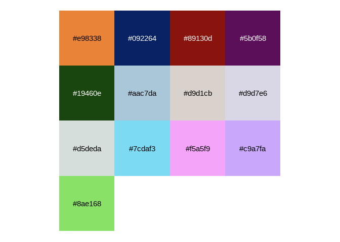
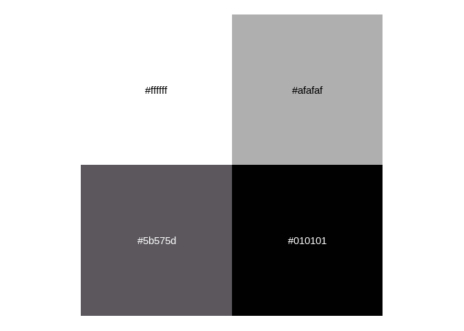
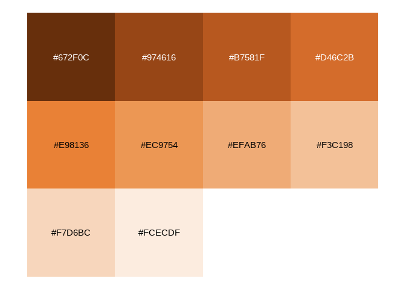
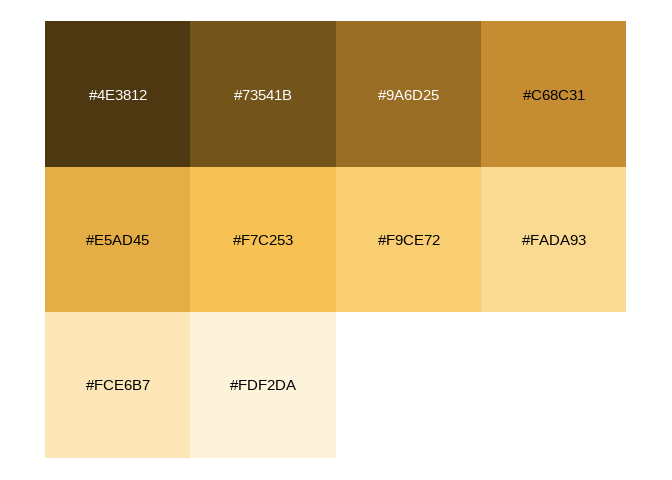

<!-- README.md is generated from README.Rmd. Please edit that file -->

# ggtiger <a href="http://christophertkenny.com/ggtiger/"></a>

<!-- badges: start -->

[](https://github.com/christopherkenny/ggtiger/actions/workflows/R-CMD-check.yaml)
<!-- badges: end -->

`ggtiger` offers a setup for `ggplot2` that follows the Princeton
University brand guidelines, where possible. As some fonts must be
sourced from the [Office of
Communications](https://communications.princeton.edu/guides-tools/logo-graphic-identity),
this will search for them locally first. If none are available, it uses
secondary fonts from the brand guidelines and downloads them from Google
Fonts if necessary. It contains several color palettes, as designed for
“infographics” by the Office of Communications.

## Installation

You can install the development version of `ggtiger` from
[GitHub](https://github.com/) with:

``` r
# install.packages("pak")
pak::pak("christopherkenny/ggtiger")
```

## Example

This is a package attempts to capture the Princeton University brand
guidelines for making plots in `ggplot2`.

``` r
library(ggtiger)
library(ggplot2)

mpg |>
  ggplot() +
  geom_density(aes(x = cty, fill = factor(cyl)), alpha = 0.8) +
  labs(
    title = 'Density plot',
    subtitle = 'City Mileage Grouped by Number of cylinders',
    caption = 'Source: mpg',
    x = 'City Mileage',
    fill = '# Cylinders'
  ) +
  facet_wrap(~ (hwy > 29)) +
  scale_fill_princeton_d() +
  theme_princeton()
```


All color schemes are included in `princeton`, which is a list of
[palette](https://github.com/christopherkenny/palette) vectors.

    #> core



    #> neutrals



    #> coreplus


    #> categorical


    #> diverging


    #> sequential_orange



    #> sequential_red


    #> sequential_olive


    #> sequential_sky_blue


    #> sequential_royal_blue


    #> sequential_grey_blue


    #> sequential_yellow



    #> sequential_pink


    #> sequential_grey


    #> sequential_magenta


